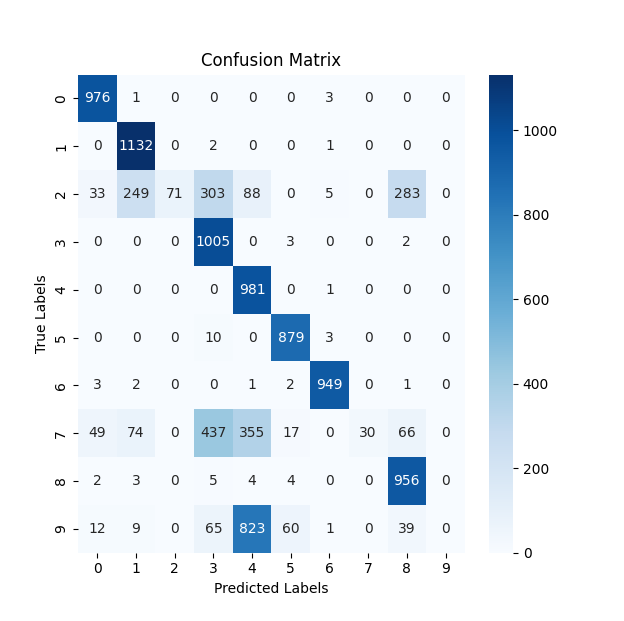

# NiteCTF 2024

Goated CTF. We somehow got #8th on this with me offically pulling up with around 1208 points. We guys as 1st yr dudes were
expecting about #50 th or so lol.

Anyways, do note that the challs I will be writing up for may not be the ones I did as per the submission log - A lot of us collabed
a lot and we submitted as fast as we could, esp with me having net problems. However, our team PlayingG0d's records should collaborate -
we guys have had an agreement on who actually did what. I'll also be saying whenever I do say I've done one but I havent submitted it.

With that bullshit outt the way, here you go -

# Glitch, Please!

Absolutely cool one. Start off by downloading and loading the csv into pandas. mess around with sorting based of the Kills/Death ratio
before actually reading the problem statement -

``..exploiting a hidden glitch-gaining unfair advantages by managing to overflow their inventory limits..``

Ah, of course. Sort the set -
```py
import pandas as pd
# Prevent truncation - pipe through less
pd.set_option('display.max_rows', None)
pd.set_option('display.max_columns', None)
pd.set_option('display.width', None)
pd.set_option('display.max_colwidth', None)

df = pd.read_csv("example.csv")

sorted_df = df.sort_values(by='ItemsCollected', ascending=False)

print("ItemsCollected (sorted):")
print(sorted_df['ItemsCollected'])
```

And see that there is a drastic drop to 150 after a few at absurdly high values - We found our cheaters.

Now reconstruct the images - beware the gotchas ! the (seemingly) BW images have values higher than 1 and we have got rgba on our hands too -

```py
import pandas as pd
from PIL import Image
import numpy as np

df = pd.read_csv("example.csv")

filtered_df = df[df['ItemsCollected'] > 150]

sorted_df = filtered_df.sort_values(by='ItemsCollected', ascending=False)

# Loop through the ProfilePic (256x256) and save each as an image using PlayerID
for _, row in sorted_df.iterrows():
    # Get the PlayerID and ProfilePic
    player_id = row["PlayerID"]
    profile_pic = row["ProfilePic (256x256)"]

    # Convert the string representation of the list to an actual list of tuples
    profile_pic = eval(profile_pic)  # Lifes too short for manually parsing
    print(player_id)

    # Check if it's a 1D array (binary values) or 2D array (RGB/RGBA values)
    if isinstance(profile_pic, list) and isinstance(profile_pic[0], tuple):
        # Check if the tuples are RGBA (i.e., 4 values per tuple)
        if len(profile_pic[0]) == 4:
            # This means it's a 2D array with RGBA
            image_array = np.array(profile_pic, dtype=np.uint8).reshape(256, 256, 4)
            image = Image.fromarray(image_array, mode='RGBA')
            image.save(f"profile_pic_rgba_{player_id}.png")
            print(f"Saved profile_pic_rgba_{player_id}.png")

        # If it's RGB (3 values per tuple)
        elif len(profile_pic[0]) == 3:
            # This means it's a 2D array with RGB
            image_array = np.array(profile_pic, dtype=np.uint8).reshape(256, 256, 3)
            image = Image.fromarray(image_array)
            image.save(f"profile_pic_rgb_{player_id}.png")
            print(f"Saved profile_pic_rgb_{player_id}.png")

    elif isinstance(profile_pic, list) and isinstance(profile_pic[0], int):
        # This means it's a 1D array of binary values (0 and 1)
        # Clamp any values above 1 to 1 (Hate yall >:3)
        profile_pic = np.clip(profile_pic, 0, 1)

        # Convert the 1D binary array to a 2D array (256x256) and map 1 to 255 (white) and 0 to 0 (black)
        image_array = np.array(profile_pic, dtype=np.uint8).reshape(256, 256) * 255
        image = Image.fromarray(image_array)
        image.save(f"profile_pic_bw_{player_id}.png")
        print(f"Saved profile_pic_bw_{player_id}.png")

    else:
        print(f"Skipping profile_pic_{player_id} due to unknown format.")
```

And we have our letters. In what order though ??

Well, we do know that ``nite`` is the first part right ? soooo -

```py
import pandas as pd

# Prevent truncation
pd.set_option('display.max_rows', None)
pd.set_option('display.max_columns', None)
pd.set_option('display.width', None)
pd.set_option('display.max_colwidth', None)

df = pd.read_csv("example.csv")

filtered_df = df[df['ItemsCollected'] > 150]

# Manually set the ids of the first 3 letters
given_order = [7387, 5854, 8936]

# Dynamically generate the list of columns to test (excluding 'PlayerID')
columns_to_test = [col for col in filtered_df.columns if col != 'PlayerID']

# Yep, we bloody brute forced it
# Hope you guys are happy.
for col in columns_to_test:
    print(f"Testing column: {col}")

    # Sort by the column in ascending order
    sorted_df_asc = filtered_df.sort_values(by=col, ascending=True)
    first_n_asc = sorted_df_asc['PlayerID'].head(len(given_order)).tolist() # Match length of given_order
    print(f"Ascending order first {len(given_order)} PlayerIDs: {first_n_asc}")

    # Check if the first 'n' PlayerIDs match the desired order
    if first_n_asc == given_order:
        print(f"Success with ascending order for {col}!")
        # Print the entire PlayerID list in this successful order
        print("Full list of PlayerIDs in ascending order:")
        print(sorted_df_asc['PlayerID'].tolist())
        break  # Exit if we find the match

    # Sort by the column in descending order
    sorted_df_desc = filtered_df.sort_values(by=col, ascending=False)
    first_n_desc = sorted_df_desc['PlayerID'].head(len(given_order)).tolist() # Match length of given_order
    print(f"Descending order first {len(given_order)} PlayerIDs: {first_n_desc}")

    # Check if the first 'n' PlayerIDs match the desired order
    if first_n_desc == given_order:
        print(f"Success with descending order for {col}!")
        # Print the entire PlayerID list in this successful order
        print("Full list of PlayerIDs in descending order:")
        print(sorted_df_desc['PlayerID'].tolist())
        break  # Exit if we find the match
```

From which we get that score is what you need to sort according to. Sort, manually match up the letters, and profit.

# Patterned secrets

Android ftw.
Havent done it on the site, but I did it :3

Spend a few hours setting up an android studio and booting up a vm.
Literally a few hours.

Now look at this [beauty](https://github.com/bolisettynihith/android-pattern-decoder) which gives you where the key is _as well as a_
rainbow table for the SHA values ! so like
```sh
adb pull /data/system/gesture.key
adb shell
rm /data/system/gesture.key
```
And we have it ! create a venv, set the script up and crack the hash. Get the plaintext and keep it for now - youll need it to crack the rc2 hash.

Now since the gesture file is deleted, We can boot up the actual VM - and explore around the vm. check the sms app (You did see the image
of the chat in the dir right ??) and then start cracking.

We see talks in the chat log about rc2. Get the weird hash (`717ea100b640a6e4aa405940e455d035`) and start cracking. Waste wayyy to much
time cracking the hash with input set to hex instead of UTF-8.

Like literall hours. Like I made so many tickets about it, I'm so sorry <3

Anyways, now you crack it and seee that the flag isssss - `nite{fake_flag}`. Fun.

Dump the chat sql from ram.img (takes a longggg time, use binwalk and snoop aroud using strings and grep to match known values), get the other rc2 hash, crack it, and profit.

# Troubled Classifier

Absolutely overkilled this one. Like overengineered to the extreme.

So like start of with the model. Run it on the test dataset and see that it gets really low scores. Mess around with a bit and give up on the model.
Start training a new basic ConvNet on the train dataset based of suggestions from the requests made and watch it learn for a bit.

```py
import os
import numpy as np
from tensorflow.keras.models import Sequential
from tensorflow.keras.layers import Dense, Flatten, Conv2D, MaxPooling2D
from tensorflow.keras.preprocessing import image
from tensorflow.keras.utils import to_categorical
from tensorflow.keras.optimizers import Adam
from tensorflow.keras.models import load_model

def load_images_from_folder(folder):
    images = []
    labels = []
    for label in os.listdir(folder):
        label_folder = os.path.join(folder, label)
        if os.path.isdir(label_folder):
            for filename in os.listdir(label_folder):
                img_path = os.path.join(label_folder, filename)
                img = image.load_img(img_path, target_size=(28, 28), color_mode='grayscale')
                img_array = image.img_to_array(img) / 255.0  # Normalize the image
                images.append(img_array)
                labels.append(int(label))  # The label is the folder name
    return np.array(images), np.array(labels)

train_images, train_labels = load_images_from_folder('./train')

test_images, test_labels = load_images_from_folder('./test')

train_images = train_images.reshape(-1, 28, 28, 1)
test_images = test_images.reshape(-1, 28, 28, 1)

train_labels = to_categorical(train_labels, num_classes=10)
test_labels = to_categorical(test_labels, num_classes=10)

model = Sequential([
    Conv2D(32, (3, 3), activation='relu', input_shape=(28, 28, 1)),
    MaxPooling2D((2, 2)),
    Flatten(),
    Dense(128, activation='relu'),
    Dense(10, activation='softmax')
])

model.compile(optimizer=Adam(), loss='categorical_crossentropy', metrics=['accuracy'])
model.fit(train_images, train_labels, epochs=5, batch_size=32)

# Evaluate the model on the test dataset
test_loss, test_accuracy = model.evaluate(test_images, test_labels)

# Print the test accuracy
print(f"Test accuracy: {test_accuracy * 100:.2f}%")
```

We see the net has a acc of around 99 to 84% on train, but only 71 on test. That smells a bit. Generally that'd be overfitting, but -

- the model is smoll asf
- It's MNIST -  this is already solved and is literally the easiest ml chall
- It's a CTF lol

So you ponder a bit and decide to plot a confusion matrix -



Weird. 2, 7 and 9 have something wrong with them. Look at those images in the train dir and facepalm hard enough to cause a
richter scale 8 earthquake.


See those weird stuff at the top ? seems a bit like only having two colour values. Almost like it represents binary.

```py
import numpy as np
from PIL import Image
import glob
import os

def decode_image(image):
    if isinstance(image, Image.Image):
        image = np.array(image)

    # Flatten the image to treat it as a 1D array
    flattened_image = image.flatten()

    # Extract the pixel values at the first unique indexes
    color_0 = flattened_image[0]
    i = 0
    color_1 = flattened_image[i]
    while color_0 == color_1:
        i += 1
        color_1 = flattened_image[i]

    binary_sequence = []

    for i in range(28*5):  # That 5 took me way too long
        pixel_value = flattened_image[i]

        # Determine if the pixel represents 0 or 1 based on the known indexes
        if pixel_value == color_0:
            binary_sequence.append('0')
        elif pixel_value == color_1:
            binary_sequence.append('1')
        else:
            binary_sequence.append('?')

    # Join the binary sequence into a string
    binary_string = ''.join(binary_sequence)

    return binary_string

def binary_to_ascii(binary_string):
    # Remove unknown characters (e.g., '?')
    if '?' in binary_string:
    	raise ValueError("Binary string contains unknown characters")

    # Convert binary to ASCII
    ascii_text = ''.join(
        chr(int(binary_string[i:i+8], 2)) for i in range(0, len(binary_string), 8)
    )

    return ascii_text

# Set to store unique decoded texts
unique_texts = set()

# Path to the directory containing the images
base_path = "./MNIST/train"

# Iterate over all train_image_*.png files in all subdirectories
for file_path in glob.glob(os.path.join(base_path, "*", "*.png")):
    try:
        # Load the image (ensure it is 28x28 in size)
        image = Image.open(file_path).convert("L")  # Convert to grayscale (if necessary)
        image = np.array(image)

        # Decode the binary sequence
        decoded_sequence = decode_image(image)

        # Convert binary to ASCII
        ascii_output = binary_to_ascii(decoded_sequence)

        if ascii_output:  # If valid ASCII text is decoded
            unique_texts.add(ascii_output)
    except Exception as e:
        print(f"Error processing file {file_path}: {e}")

# Print all unique texts
print("\nUnique Decoded Texts:")
for text in sorted(unique_texts):
    print(text)
```

Since the decoding was ridiculously fast, we can afford to check for strings in the entire train directory. Find out how many lines the
string is encoded in, and score, you get the flag by putting together the peices.

I also have done **Restricted Jumper** on the site, but I feel like others did more of that, so I'll let them write the writeup.
